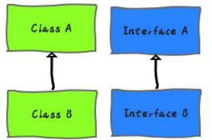

# Java
- Java是一门面向对象编程语言，不仅吸收了C++语言的各种优点，还摒弃了C++里难以理解的多继承、指针等概念，因此Java语言具有功能强大和简单易用两个特征。
1. 简单性
   1. Java 剔除了 C++ 中许多很少使用、 难以理解、 易混淆的特性。
2. 面向对象（面向对象编程（Object-Oriented Programming OOP））
   1. 简单地讲， 面向对象设计是一种程序设计技术。 它将重点放在数据 （即对象）和对象的接口上。
3. 分布式
   1. Java 有一个丰富的例程库，用于处理像 HTTP 和 FIT 之类的 TCP/IP 协议。Java 应用程序能够通过 URL 打开和访问网络上的对象，其便捷程度就好像访问本地文件一样。
4. 健壮性
   1. Java 编译器能够检测许多在其他语言中仅在运行时才能够检测出来的问题。 
5. 安全性
6. 体系结构中立
7. 可移植性
   1. 如，Java 中的 int 永远为 32 位的整数，在 Java 中，数据类型具有固定的大小。 二进制数据以固定的格式进行存储和传输， 消除了字节顺序的困扰。字符串是用标准的 Unicode 格式存储。
8. 解释型
9. 高性能
10. 多线程
11. 动态性

- Java分为三个体系：
   - JavaSE(J2SE)	(Java2 Platform Standard Edition，java平台标准版)
   - JavaEE(J2EE)	(Java 2 Platform,Enterprise Edition，java平台企业版)
   - JavaME(J2ME)	(Java 2 Platform Micro Edition，java平台微型版)
      - 2005 年 6 月，JavaOne 大会召开，SUN 公司公开 Java SE 6。此时，Java 的各种版本已经更名，以取消其中的数字 "2"：J2EE 更名为 Java EE，J2SE 更名为Java SE，J2ME 更名为 Java ME。 
# 面向对象
## 面向过程

- 自顶而下的编程模式
   - 把问题分解成一个一个步骤，每个步骤用函数实现，依次调用即可。
      - 就是说，在进行面向过程编程的时候，不需要考虑那么多，上来先定义一个函数，然后使用各种诸如 if-else、for-each 等方式进行代码执行。
## 什么是面向对象

-  Object Oriented Programming  OOP
- 将事务高度抽象化的编程模式
   - 将问题分解成一个一个步骤，对每个步骤进行相应的抽象，形成对象，通过不同对象之间的调用，组合解决问题。
      - 就是说，在进行面向对象进行编程的时候，要把属性、行为等封装成对象，然后基于这些对象及对象的能力进行业务逻辑的实现
      - 比如：想要造一辆车，上来要先把车的各种属性定义出来，然后抽象成一个Car类。
## 封装(Encapsulation)

- 有时称为数据隐藏。
- 从形式上看，封装是将数据和行为组合在一个包中，并对对象的使用者隐藏了数据的实现方式。对象中的数据称为实例域（instance field）, 操纵数据的过程称为方法（method） 对于每个特定的类实例（对象）都有一组特定的实例域值。这些值的集合就是这个对象的当前状态（ state )。封装给对象赋予了“ 黑盒” 特征， 这是提高重用性和可靠性的关键。
- 

- 把客观事物封装成抽象的类，并且类可以把自己的数据和方法只让可信的类或者对象操作，对不可信的进行信息隐藏。
- 封装是面向对象的特征之一，是对象和类概念的主要特性。简单的说，**一个类就是一个封装了数据以及操作这些数据的代码的逻辑实体。在一个对象内部，某些代码或某些数据可以是私有的，不能被外界访问。通过这种方式，对象对内部数据提供了不同级别的保护，以防止程序中无关的部分意外的改变或错误的使用了对象的私有部分。 **
## 继承(Inheritance)

- 继承使⽤已存在的类的定义作为基础建⽴新类的技术，新类的定义可以增加新的数据或新的功能，也可以⽤⽗类的功能，但不能选择性地继承父类。通过使⽤继承我们能够⾮常⽅便地复⽤以前的代码
- 

- 总结：它可以使用现有类的所有功能，并在无需重新编写原来的类的情况下对这些功能进行扩展。
- 通过继承创建的新类称为“子类”或“派生类”，被继承的类称为“基类”、“父类”或“超类”。继承的过程，就是从一般到特殊的过程。
- 继承概念的实现方式有二类：实现继承与接口继承。实现继承是指直接使用基类的属性和方法而无需额外编码的能力；接口继承是指仅使用属性和方法的名称、但是子类必须提供实现的能力。
### Java 的继承与实现
Java 中继承和实现都体现了传递性。明确定义如下：

- **继承**：如果多个类的某个部分的功能相同，那么可以抽象出一个类出来，把他们的相同部分都放到父类里，让他们都继承这个类。	
- **实现**：如果多个类处理的目标是一样的，但是处理的方法方式不同，那么就定义一个接口，也就是一个标准，让他们的实现这个接口，各自实现自己具体的处理方法来处理那个目标
- 

- 继承的根本原因是因为要复用，而实现的根本原因是需要定义一个标准。

- 在 Java 中，继承使用 **extends **关键字实现，而实现通过 **implements **关键字。
- 单继承，多实现，接口可以可以多继承接口。
- 声明为私有的类的成员不会被该类的子类继承。[参考](https://docs.oracle.com/javase/specs/jls/se11/html/jls-8.html#jls-8.2)
- 构造函数不会被继承。
- 

- 抽象类或方法用 **abstract** 修饰。
- 接口用 **interface** 声明。
#### Java 中的接口

- 声明     `interface 接口名 {}`

- 只能有抽象方法（JDK 7及以前）
- 只能有常量
- 

- 默认使用 public abstract 修饰方法（JDK 7及以前）
- 默认使用 public static final 来修饰成员变量（常量）
#### Java 8 接口新增方法

- **静态方法与默认方法**
```java
interface Person{
	public static void method1() {
		System.out.println("hello...");
	} 
	
	default void method2() {
		System.out.println("world...");
	}
}

class Student implements Person{
	public static void main(String[] args) {
		Person.method1();
		Student stu = new Student();
		stu.method2();
	}
}
```

- **如果先在一个接口中定义了一个默认方法， 然后又在父类或另一个接口中定义了同样的方法， 会发生什么情况？**
   - 父类优先。如果父类提供了一个具体方法，而且有相同参数类型，接口的默认方法会被忽略。（**类优先**）
   - 

   - 接口冲突。如果一个超接口提供了一个默认方法（或抽象方法），另一个接口提供了一个同名而且参数类型相同的抽象或默认方法， 必须**覆盖（重写）这个方法来解决冲突**。或子类本身也声明为一个抽象类。
#### Comparable 接口与 Comparator 接口

- **Comparable 接口：  自然排序**
- 

- 像String、Integer、BigInteger、BigDecimal等类实现了Comparable接口，重写了compareTo(Object obj)方法，比较两个对象的方法。

- **重写compareTo(Object obj)的规则**
   - `if(getClass() != obj.getClass()) throw new ClassCastException();`
      - 如果不允许子父类、同父类的不同子类相互比较，可加上这一行
   - 如果this大于形参对象obj，则返回正整数，
   - 如果this小于形参对象obj，则返回负整数，
   - 如果this等于形参对象obj，则返回零。

- **Comparator 接口： 定制排序**
- 

- 当元素的类型没有实现java.lang.Comparable接口而又不方便修改代码，或者实现了java.lang.Comparable接口的排序规则不适合当前的操作(如对String按长度)，可以使用Comparator的对象来排序，强行对多个对象进行整体排序的比较。

- **重写compare(Object o1, Object o2)的规则**
   - 如果方法返回正整数，则表示o1大
   - 如果返回0，表示相等
   - 返回负整数，表示o1小。
   - 

   - 重写时如果o1>o2返回负数则由大到小排序
   - 

   - 可以将Comparator传递给sort方法（如 Collections.sort或Arrays.sort)，从而允许在排序顺序上实现精确控制。
   - 

   - 还可以使用 Comparator来控制某些数据结构（如有序set或有序映射）的顺序，或者为那些没有自然顺序的对象collection提供排序。

### Java 的继承与组合
继承（Inheritance）是一种联结类与类的层次模型。指的是一个类（称为子类、子接口）继承另外的一个类（称为父类、父接口）的功能，并可以增加它自己的新功能的能力，继承是类与类或者接口与接口之间最常见的关系；继承是一种 is-a 关系。


组合(Composition)体现的是整体与部分、拥有的关系，即 has-a 的关系。


### 组合与继承的区别和联系
继承结构中，父类的内部细节对于子类是可见的。所以我们通常也可以说通过继承的代码复用是一种**白盒式**代码复用。（如果基类的实现发生改变，那么派生类的实现也将随之改变。这样就导致了子类行为的不可预知性。）

组合是通过对现有的对象进行拼装（组合）产生新的、更复杂的功能。因为在对象之间，各自的内部细节是不可见的，所以我们也说这种方式的代码复用是**黑盒式**代码复用。（因为组合中一般都定义一个类型，所以在编译期根本不知道具体会调用哪个实现类的方法）继承，在写代码的时候就要指名具体继承哪个类，所以，在编译期就确定了关系。（从基类继承来的实现是无法在运行期动态改变的，因此降低了应用的灵活性。）组合，在写代码的时候可以采用面向接口编程。所以，类的组合关系一般在运行期确定。

| **组 合 关 系** | **继 承 关 系** |
| --- | --- |
| 优点：不破坏封装，整体类与局部类之间松耦合，彼此相对独立 | 缺点：破坏封装，子类与父类之间紧密耦合，子类依赖于父类的实现，子类缺乏独立性 |
| 优点：具有较好的可扩展性 | 缺点：支持扩展，但是往往以增加系统结构的复杂度为代价 |
| 优点：支持动态组合。在运行时，整体对象可以选择不同类型的局部对象 | 缺点：不支持动态继承。在运行时，子类无法选择不同的父类 |
| 优点：整体类可以对局部类进行包装，封装局部类的接口，提供新的接口 | 缺点：子类不能改变父类的接口 |
| 缺点：整体类不能自动获得和局部类同样的接口 | 优点：子类能自动继承父类的接口 |
| 缺点：创建整体类的对象时，需要创建所有局部类的对象 | 优点：创建子类的对象时，无须创建父类的对象 |

### 如何选择

- 原则『多用组合、少用继承』
- 继承要慎用，其使用场合仅限于你确信使用该技术有效的情况。
   - 一个判断方法是，是否需要从新类向基类进行向上转型。如果是必须的，则继承是必要的。反之则应该好好考虑是否需要继承。《Java编程思想》
   - 只有当子类真正是超类的子类型时，才适合用继承。换句话说，对于两个类A和B，只有当两者之间确实存在[is-a](https://zh.wikipedia.org/wiki/Is-a)关系的时候，类B才应该继承类A。《Effective Java》
### 代码块与构造器执行顺序
```java
class Demo extends father {
	{
		System.out.println("⑤子类，局部代码块");
	}

	public Demo() {
		System.out.println("⑥子类，构造方法");
	}

	static {
		System.out.println("②子类，静态代码块");
	}
	
	public static void main(String[] args) {
		System.out.println("⑦" + new Demo());
	}
}

class father {
	public father() {
		System.out.println("④父类，构造方法");
	}
	
	{
		System.out.println("③父类，局部代码块");
	}

	static {
		System.out.println("①父类，静态代码块");
	}
}

// ①父类，静态代码块
// ②子类，静态代码块
// ③父类，局部代码块
// ④父类，构造方法
// ⑤子类，局部代码块
// ⑥子类，构造方法
// ⑦com.test.Demo@1175e2db

// 插一句：如果仅通过类名去调用类的类变量。并不会初始化类和父类，只会加载静态域。
```
## 多态(Polymorphism)

- 多态指一个类实例的相同方法在不同情形有不同表现形式。多态机制使具有不同内部结构的对象可以共享相同的外部接口。这意味着，虽然针对不同对象的具体操作不同，但通过一个公共的类，它们（那些操作）可以通过相同的方式予以调用。
### Java中的多态

- 同一操作作用于不同的对象，可以有不同的解释，产生不同的执行结果。如果按照这个概念来定义的话，那么多态应该是一种**运行期的状态（动态绑定）。 **
- 

- 编译时看的是左边，运行时看的左边


- 多态不适用于**变量**
- 

- 无法直接访问子类特有的成员方法
### 多态的必要条件

- 类继承或者接口实现
- 子类要**重写**父类的方法
- 父类的引用指向子类的对象。
### 方法的重载时多态吗

- 还有一种说法，包括维基百科也说明，多态还分为动态多态和静态多态。上面提到的那种动态绑定认为是动态多态，因为只有在运行期才能知道真正调用的是哪个类的方法。
- 一般认为 Java 中的函数重载是一种静态多态，因为他需要在编译期决定具体调用哪个方法。
- 关于这个动态静态的说法，“我”更偏向于重载和多态其实是无关的。
   - 如果在面试的时候，“我可能”会认为重载也算是多态，毕竟面试官也有他的观点。我会和面试官说：我认为，多态应该是一种运行期特性，Java 中的重写是多态的体现。不过也有人提出重载是一种静态多态的想法，这个问题在 StackOverflow 等网站上有很多人讨论，但是并没有什么定论。我更加倾向于重载不是多态。
### 方法的重写与重载
#### 重写的条件

- **参数列表**必须完全与被重写方法的相同；
- **返回类型**必须完全与被重写方法的返回类型（可以是子类）相同；
- **访问修饰符**范围大于等于被重写的方法；
- 重写的方法能够**抛出更少或更有限的异常**（被重写的方法声明了异常，但重写的方法可以什么也不声明）；
- 父类类方法访问修饰符为 private/final/static 则子类就不能重写该方法，但被 static 修饰的方法能被再次声明。
```java
class Phone {
    void call() {
        System.out.println("打电话");
    }

    Phone instance() {
        return new Phone();
    }
}

class NewPhone extends Phone {

    @Override
    public void call() {
        System.out.println("录音");
        //super.call();
    }

    @Override
    NewPhone instance() {
//    Phone instance() {
        return new NewPhone();
    }
    
    public static void main(String[] args) {
        NewPhone np = new NewPhone();
        np.call();
    }
}
```
#### 重载的条件

- 被重载的方法必须有**不同参数列表**；
- 被重载的方法**可以改变返回类型**；
- 被重载的方法**可以改变访问修饰符**；
- 被重载的方法**可以声明新的或更广的检查异常**；
- 方法能够在同一个类中或者在一个子类中被重载。 
## 类变量、成员变量和局部变量
Java中共有三种变量，分别是类变量、成员变量和局部变量。他们分别存放在JVM的~~方法区~~堆内存、堆内存和栈内存中。
```java
public class Variables {
    /**
     * 类变量，static修饰
     * 默认赋初始值
     */
    private static int a;

    /**
     * 成员变量
     */
    private int b;

    /**
     * @param c 局部变量
     */
    public void test(int c){
        // 局部变量
        int d;
    }
}
```

- 类变量、成员变量默认赋初始值
- 
## Java 中的值传递
### 形参与实参

- **形式参数：**是在定义函数名和函数体的时候使用的参数，目的是用来接收调用该函数时传入的参数。
- **实际参数：**在调用有参函数时，主调函数和被调函数之间有数据传递关系。在主调函数中调用一个函数时，函数名后面括号中的参数称为“实际参数”
```java
public void method1() {
  method2("jack");  // 实际参数为 "jack"
}

public void method2(String name) { //形式参数为 name
  System.out.println(name);
}
```
### 值传递与引用传递

- **值传递（pass by value）**是指在调用函数时将实际参数`复制`一份传递到函数中，这样在函数中如果对参数进行修改，将`不会影响到实际参数`。
- **引用传递（pass by reference）**是指在调用函数时将实际参数的地址`直接`传递到函数中，那么在函数中对参数所进行的修改，将`影响到实际参数`。
### Java 中只有值传递

## 可变参数
```java
/*
    可变参数：
        格式：修饰符 返回值类型 方法名（数据类型...变量名）{}
        public static int sum(int...a) {}

        注意：
            1.变量是数组
            2.如果方法有多个参数，可变参数放最后
 */
public class ArgsDemo {
    public static void main(String[] args) {
        System.out.println(sum());
        System.out.println(sum(1,2));
        System.out.println(sum(1,2,3));
    }
    
   /* public static int sum(int b,int...a) {
        return 0;
    }*/

    public static int sum(int...a) {
        // System.out.println(a);//[I@b4c966a
        int sum = 0;
        for (int i : a) {
            sum += i;
        }
        return sum;
    }
}
```
# 基础语句
## for
```java
for (int i = 0; i < 10; i++) {
	// body
}
```
## if
只执行最先遇到的满足条件的if语句，没有满足的条件不执行。
## switch

- 格式：注意别忘了**break;**语句
```
switch(表达式){
  case值1：
    语句体1；
    break；
  case值2；
    语句体2；
    break；
  ....
  default;
    语句体n+1；
    [break;]
}

// ******************************
int week=sc.nextInt();
switch (week){
case 1:
System.out.println("星期一");
break;
case 2:
System.out.println("星期二");
break;
case 3:
...
break;
default:
System.out.println("星期日");
break;
}
```

- 以JDK 8为准，switch支持10种类型 
   - 基本类型：**byte char short int** 对于包装类 ：**Byte Short Character Integer enum(jdk5) String(jdk7)**
      - 实际只支持int类型 Java实际只能支持int类型的switch语句，对于其他的类型： 
         - 基本类型byte char short 原因：这些基本数字类型可自动向上转为int	
         - 基本类型包装类Byte Short Character Integer 原因：java的自动拆箱机制，自动转为基本类型 
         - String 类型 原因：实际switch比较的string.hashCode值，它是一个int类型
         - enum类型 原因 ：实际比较的是enum的ordinal值（表示枚举值的顺序），也是一个int类型
## while
```
while(条件语句){
  // body
}
```
## 三元表达式
`**c = a - b > 0 ? 1 : 2 	// 如果 a - b > 0 为 true 那么 c = 1 否则 c = 2**`

- 当相于

if(a - b > 0){
	c = 1 ;
} else {
	c = 2;
}
## 数据输入

- Scanner input =new Scanner(System.in);
- 

- BufferedReader input = new BufferedReader(new InputStreamReader(System.in));
## 随机数
### Random
```java
Random r =new Random();
int number = r.nextInt(); // 随机数
int number = r.nextInt(10); // 随机数，范围[0,10)
```
### Math.random()
```java
double number = Math.random(); // 范围[0.0, 1.0)
```
### 4位验证码
```java
Random r =new Random();
int code = r.nextInt(9000) + 1000;
```
# 基本数据类型

- 字符型
   - **char （16位）**
- 布尔型
   - **boolean**
- 数值型
   - 整型：**byte、short、int、long**
   - 浮点型：**float（单精度 32位）、double（双精度 64位）**
## 整型的取值范围

- 1字节=8位（bit）。Java中的整型属于有符号数。
- 8bit可以表示的数字： 最小值：10000000 （-27 = -128，即-128~-1，一共128个数） 最大值：01111111（27-1 = 127，即0~127，一共是128位数） 
   - 具体参考[文章](https://www.cnblogs.com/wqbin/p/11142873.html)

- byte：**1**个字节存储，范围为-128(-2^7)到127(2^7-1)
- short：**2**个字节存储，范围为-32,768 (-2^15)到32,767 (2^15-1)
- int：**4**个字节存储，范围为-2,147,483,648 (-2^31)到2,147,483,647 (2^31-1)
- long：**8**个字节存储，范围为-9,223,372,036,854,775,808 (-2^63)到9,223,372,036, 854,775,807 (2^63-1)
### 溢出
溢出的时候并不会抛异常，也没有任何提示。
```java
int i = Integer.MAX_VALUE; 
int j = Integer.MAX_VALUE; 
int k = i + j; 
System.out.println(k); // -2
```
## 什么是浮点型

- 计算机的数字的存储和运算都是通过二进制进行的，十进制整数转换为二进制整数采用“**除2取余，逆序排列**”法
- 

- 具体做法：
   - 用2整除十进制整数，可以得到一个商和余数；
   - 再用2去除商，又会得到一个商和余数，如此进行，直到商为小于1时为止
   - 然后把先得到的余数作为二进制数的低位有效位，后得到的余数作为二进制数的高位有效位，依次排列起来。
   


- **十进制小数转换成二进制小数采用“乘2取整，顺序排列”法。**
- 

- 具体做法：
   - 用2乘十进制小数，得到积
   - 将积的整数部分取出，再用2乘余下的小数部分，又得到一个积
   - 再将积的整数部分取出，如此进行，直到积中的小数部分为零，此时0或1为二进制的最后一位。或者达到所要求的精度为止。
   - 

- 0.1的二进制表示中出现了无限循环的情况，也就是(0.1)10 = (0.000110011001100…)2
- 计算机就没办法用二进制精确的表示0.1了。所以，为了解决部分小数无法使用二进制精确表示的问题，于是就有了IEEE 754规范。**IEEE**二进制浮点数算术标准（IEEE 754）是20世纪80年代以来最广泛使用的浮点数运算标准，为许多CPU与浮点运算器所采用。

- IEEE 754规定了四种表示浮点数值的方式：**单精确度（32位）、双精确度（64位）**、延伸单精确度（43比特以上，很少使用）与延伸双精确度（79比特以上，通常以80位实现）。
- IEEE只是提出了一种使用近似值表示小数的方式，并且引入了精度的概念。

### 单精度与双精度

- 单精度浮点数在计算机存储器中占用4个字节（32 bits），利用“浮点”（浮动小数点）的方法，可以表示一个范围很大的数值。
- 比起单精度浮点数，双精度浮点数(double)使用 64 位（8字节） 来存储一个浮点数。

- 由于计算机中保存的小数其实是十进制的小数的近似值，并不是准确值，不要在代码中使用浮点数来表示金额等重要的指标。建议使用**BigDecimal**或者**Long**（单位为分）来表示金额。
## 运算符优先级


## 按位、移位操作符
```java
“与”  	&		&=
“或”  	|		|=
“取反”  	~
“异或”	^		^=


public class test {
    public static void main(String[] args) {
        int i = 10;
        int j = 7;

        System.out.println(i&j); // 与 2
        System.out.println(i|j); // 或 15
        System.out.println(i^j); // 异或 13
        System.out.println(~i); // 取反 -11		-n=~n+1
        System.out.println(~0); // 取反 -1
        System.out.println(~(-9)); // 8 
        System.out.println(7<<2);   // 左移位操作符    28 
        System.out.println(7>>2);   // 右移位操作符    1 
        System.out.println(7>>>2);  // “无符号” 右移位操作符 ，即不带符号  1
        System.out.println(-7>>1);  // -4
        System.out.println(-7>>>2);  // “无符号” 右移位操作符    1073741822


        /*
        Java使用补码来存储二进制数
        正数的原码、反码、补码都一样
	   负数的
		反码就是符号位不变其余位取反
		补码是该数的反码加1

		  ~10
		  10原码（简写）：00001010
		            取反：11110101
			 还原：
				 ①变补码：11110100
			     ②取反：	10001011   -11

            7<<2
            补：00000000 00000000 00000000 00000111
            补：00000000 00000000 00000000 00011100
            28

		   右移：正数高位补0，负数高为补1
            7>>2
            00000000 00000000 00000000 00000111
            00000000 00000000 00000000 00000001
            1
         */
    }
}


一个int是4字节32比特所以 -7 标准原码写法 10000000 00000000 00000000 00000111
							反码：11111111 11111111 11111111 11111000
							补码：11111111 11111111 11111111 11111001

-7>>1：
	   -7补码：11111111 11111111 11111111 11111001
	右移一位：11111111 11111111 11111111 11111100
	转为原码：
		  ① -1：11111111 11111111 11111111 11111011
		②取反：10000000 00000000 00000000 00000100  -> 4

-7>>>2：
		    -7补码：11111111 11111111 11111111 11111001
	无符号右移二位：00111111 11111111 11111111 11111110  此时最高位为0，已变为正数：正数的原码、反码、补码都一样！
		     原码：00111111 11111111 11111111 11111110   1073741822
			


```
